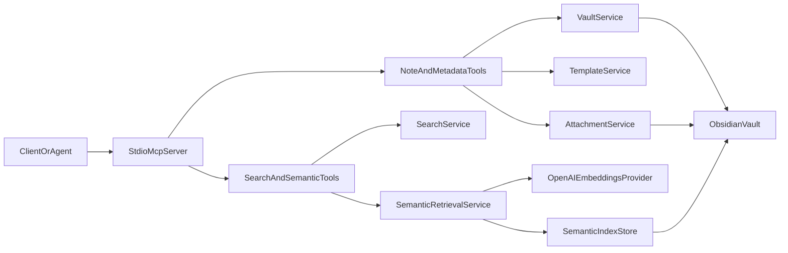

# Obsidian MCP

`obsidian-mcp` is a stdio-based Model Context Protocol server for working with an Obsidian vault safely from AI clients and local tooling. It provides note CRUD operations, keyword search, semantic retrieval, template rendering, daily-note helpers, frontmatter updates, and attachment storage while keeping the Markdown vault as the source of truth.

This README is intentionally written as a high-signal project briefing. It is meant to help humans and AI agents understand how the project is structured, how it runs, what tools it exposes, and what operational rules matter before they start scanning the codebase.

## What This Project Does

- Exposes an MCP server over `stdio` rather than HTTP.
- Reads and writes Markdown notes inside an Obsidian vault.
- Enforces safe updates with version tokens unless force overrides are enabled.
- Supports Obsidian-friendly templates, daily notes, frontmatter merges, and attachments.
- Offers both exact/keyword search and semantic chunk retrieval.
- Stores semantic index artifacts in a hidden folder inside the vault so the vault remains the canonical source of data.

## Who This Is For

- AI agents that need structured access to an Obsidian vault.
- Developers embedding vault access into MCP-capable clients.
- Operators who want to run the server locally or in Docker.
- Maintainers who need a quick map of the codebase and runtime behavior.

## Runtime Model

The server is initialized in `src/server.ts`. It loads config, constructs services, registers tools, and connects to a `StdioServerTransport`. There is no REST API, no browser UI, and no SSE layer in this repo.



## Core Capabilities

### Note operations

- Create notes with optional frontmatter, tags, aliases, folder overrides, and template rendering.
- Read notes by vault-relative path or exact title.
- Update full note bodies, individual headings, or frontmatter.
- Append content to an existing note or create one during append.

### Search

- `search_notes` performs exact/substring-style matching across title, body, folder, and tag filters.
- `semantic_search_notes` performs embedding-based retrieval over indexed note chunks.
- `get_relevant_context` returns a compact, source-aware bundle of chunks for retrieval-augmented answering.

### Obsidian-specific helpers

- Create notes from templates.
- Append to daily notes, optionally creating them from templates.
- Merge frontmatter without rewriting the whole note from the client side.
- Store attachments in the vault and return Obsidian-friendly references.

## Quick Start

### 1. Install dependencies

```bash
npm install
```

### 2. Configure environment

Copy `.env.example` to `.env` and update the vault path and OpenAI settings as needed.

Required for normal vault use:

- `OBSIDIAN_VAULT_PATH`

Required for semantic indexing and semantic search:

- `OPENAI_API_KEY`

Important default behavior:

- Local Node runs default to `OBSIDIAN_VAULT_PATH=/vault` unless you override it.
- Docker Compose mounts `${OBSIDIAN_VAULT_HOST_PATH}` into `${OBSIDIAN_VAULT_PATH}`.

### 3. Validate vault access

```bash
npm run validate:vault
```

This checks that `OBSIDIAN_VAULT_PATH` resolves to a readable, writable directory.

### 4. Run in development

```bash
npm run dev
```

This executes `tsx src/server.ts`.

### 5. Build and run production output

```bash
npm run build
npm start
```

This compiles TypeScript to `dist/` and runs `node dist/server.js`.

### 6. Run with Docker Compose

```bash
docker compose up --build
```

The compose file builds the image locally, passes `.env`, mounts the configured vault directory, and starts `node dist/server.js`.

## Environment Reference

The server reads environment variables in `src/config.ts` using `dotenv` and validates them with `zod`.

| Variable | Required | Default | Purpose |
| --- | --- | --- | --- |
| `OBSIDIAN_VAULT_PATH` | Yes | `/vault` | Absolute path to the vault inside the running environment. |
| `OBSIDIAN_TEMPLATE_FOLDER` | No | `Templates` | Vault-relative folder for Obsidian templates. |
| `OBSIDIAN_ATTACHMENTS_FOLDER` | No | `Assets` | Default folder for stored attachments. |
| `OBSIDIAN_DAILY_NOTES_FOLDER` | No | `Daily Notes` | Folder used by `append_daily_note`. |
| `OBSIDIAN_DEFAULT_NOTE_FOLDER` | No | `Inbox` | Default folder for newly created notes when no path is provided. |
| `OBSIDIAN_NOTE_EXTENSION` | No | `.md` | Note extension. A leading dot is normalized automatically. |
| `OBSIDIAN_ALLOW_UNSAFE_OVERWRITE` | No | `false` | If `true`, bypasses version-token safety checks globally. |
| `OPENAI_API_KEY` | Semantic only | none | Required to build or query the semantic index. |
| `OPENAI_BASE_URL` | No | none | Optional custom base URL for the OpenAI client. |
| `OBSIDIAN_SEMANTIC_INDEX_FOLDER` | No | `.obsidian-mcp/semantic-index` | Hidden vault-relative folder for index artifacts. |
| `OBSIDIAN_SEMANTIC_EMBEDDING_MODEL` | No | `text-embedding-3-small` | Embedding model used for indexing and querying. |
| `OBSIDIAN_SEMANTIC_CHUNK_SIZE` | No | `1200` | Maximum chunk size in characters before splitting. |
| `OBSIDIAN_SEMANTIC_CHUNK_OVERLAP` | No | `200` | Overlap between chunks. Must be smaller than chunk size. |
| `OBSIDIAN_SEMANTIC_TOP_K` | No | `8` | Default top-K result count for semantic retrieval. |
| `OBSIDIAN_SEMANTIC_BATCH_SIZE` | No | `50` | Embedding batch size during index builds and updates. |
| `OBSIDIAN_VAULT_HOST_PATH` | Docker Compose only | none | Host-side vault path used by `docker-compose.yml`. This is not read by the Node app directly. |

### Config constraints

- `OBSIDIAN_SEMANTIC_CHUNK_OVERLAP` must be smaller than `OBSIDIAN_SEMANTIC_CHUNK_SIZE`.
- If `OPENAI_API_KEY` is missing, semantic operations fail even though non-semantic vault tools still work.
- The semantic index path is normalized as a vault-relative path and resolved under the vault root.

## MCP Tool Catalog

All tools are registered in `src/server.ts` and implemented under `src/tools/`.

### Notes

| Tool | What it does |
| --- | --- |
| `create_note` | Creates a Markdown note with optional folder/path overrides, frontmatter, tags, aliases, and template rendering. |
| `read_note` | Reads a note by path or exact title and returns the current `versionToken`. |
| `update_note` | Safely replaces body content, updates a heading, and/or merges frontmatter. |
| `append_to_note` | Appends Markdown to a note or a specific heading without rewriting the full file client-side. |

### Search and retrieval

| Tool | What it does |
| --- | --- |
| `search_notes` | Keyword and metadata search by text, title, folder, and tag. |
| `semantic_search_notes` | Returns ranked note chunks using semantic embeddings plus metadata-aware scoring. |
| `get_relevant_context` | Builds a compact context bundle and source list for question answering. |
| `reindex_vault` | Rebuilds the entire semantic index from current vault contents. |
| `reindex_note` | Refreshes the indexed state for a single existing note. |
| `semantic_index_status` | Reports whether the semantic index exists, where it lives, and how many notes and chunks it contains. |

### Metadata, journaling, templates, and attachments

| Tool | What it does |
| --- | --- |
| `upsert_frontmatter` | Safely merges frontmatter, tags, aliases, and related metadata into an existing note. |
| `append_daily_note` | Appends content to a daily note and can create it from a template if it does not exist. |
| `create_note_from_template` | Renders a template, merges additional content and frontmatter, and creates a note. |
| `create_attachment_reference` | Stores an attachment in the vault and returns an Obsidian wiki embed plus a Markdown link. |

## Safe Write Workflow

This project is opinionated about avoiding silent overwrites. The server itself advertises this in its MCP instructions.

### Recommended agent workflow

1. Call `read_note`.
2. Capture the returned `versionToken`.
3. Call `update_note`, `append_to_note`, or `upsert_frontmatter` with `expectedVersionToken`.
4. If a version conflict occurs, read the note again and retry with the fresh token.

### Why this exists

`VaultService` builds a version token from:

- a SHA-256 hash of the file contents
- the file modification time
- the file size

If the token passed by the client does not match the current token, the server throws a version conflict error instead of overwriting a possibly changed note.

### When safety checks are bypassed

- Passing `force: true` on supported write tools bypasses the token check.
- Setting `OBSIDIAN_ALLOW_UNSAFE_OVERWRITE=true` disables the check globally.

Unless you have a controlled environment, agents should prefer the safe token-based path.

## Tool Input and Output Conventions

### Common lookup pattern

Many note tools accept either:

- `path`: a vault-relative note path, with or without `.md`
- `title`: an exact note title

If multiple notes share the same title, title-only lookup fails and the client must use a path.

### Common result shape

Successful tool responses include:

- a human-readable text payload
- `structuredContent.result`

Error responses include:

- `isError: true`
- a human-readable error message
- `structuredContent.error`

### Built-in limits

- `search_notes.limit` defaults to `20`, max `100`
- `semantic_search_notes.limit` defaults to `8`, max `50`
- `get_relevant_context.maxChunks` defaults to `6`, max `20`

## Semantic Retrieval

Semantic retrieval is implemented in `src/services/semantic-retrieval.ts` and supporting modules under `src/lib/`.

### How indexing works

1. Enumerate Markdown notes in the vault.
2. Exclude the hidden semantic index folder from note scans.
3. Parse frontmatter and body.
4. Split each note into heading-aware chunks.
5. Generate embeddings for the chunks in batches.
6. Persist the index as JSON under `.obsidian-mcp/semantic-index/index.json` by default.

### Chunking behavior

Chunking is heading-aware before it becomes size-aware:

- notes are split into sections by Markdown headings
- each chunk records `notePath`, `noteTitle`, `heading`, `headingPath`, tags, modified time, and stable chunk ID
- large sections are further split using paragraph, line, and sentence break heuristics plus overlap

This design gives semantic search better note structure than plain fixed-size windowing.

### Ranking behavior

The semantic ranking is hybrid rather than embedding-only. Each candidate chunk receives:

- a cosine similarity score from the query embedding
- a keyword overlap score
- a metadata boost based on title, tag, and folder matches

The final score favors semantic similarity most strongly, but exact metadata matches can improve ranking when they are helpful.

### Query-time behavior

- `semantic_search_notes` returns ranked chunks with note path, note title, heading context, tags, content, snippet, and scores.
- `get_relevant_context` turns the top chunks into a compact context block plus a deduplicated source list.

### Index storage rules

- The vault remains the source of truth.
- The semantic index is an implementation artifact, not canonical content.
- Index files live inside a hidden folder under the vault.
- Hidden index artifacts are deliberately excluded from normal note enumeration and search.

### Semantic failure modes to know

- If the index does not exist or is empty, semantic search fails until `reindex_vault` runs.
- If the embedding model in the saved index does not match the active embedding model, the server asks you to rebuild the index.
- If `OPENAI_API_KEY` is missing, embedding generation fails for both indexing and query embeddings.
- The current MCP `reindex_note` tool is intended for existing notes because it resolves the note first; if notes were removed from the vault, `reindex_vault` is the reliable cleanup path.

## Search Behavior

There are two search layers in the project:

### `search_notes`

- scans Markdown notes directly from the vault
- supports `query`, `title`, `folder`, and `tag`
- uses substring-style matching over title and note body
- returns a note-level snippet, not chunk-level embedding results

### `semantic_search_notes`

- operates on the prebuilt semantic index rather than raw vault scans
- retrieves chunk-level results rather than note-level matches
- is better suited for natural-language retrieval and question answering

For many agent workflows, `search_notes` is a good discovery tool and `get_relevant_context` is a better pre-answer retrieval tool.

## Templates, Daily Notes, and Attachments

### Templates

Templates are rendered through `TemplateService` and can inject variables such as:

- `title`
- `notePath`
- `date`
- `time`
- `datetime`

Templates use `{{ variableName }}` token replacement in both body content and frontmatter values.

Template rendering is used by:

- `create_note`
- `create_note_from_template`
- `append_daily_note`

### Daily notes

`append_daily_note` writes to:

`<daily notes folder>/<YYYY-MM-DD><note extension>`

If the note does not exist, it can be created first and optionally rendered from a template.

### Attachments

Attachments are stored through `AttachmentService` in the configured attachments area and returned in a form that is convenient for linking from Obsidian notes.

## Development Workflow

### Scripts

| Command | Purpose |
| --- | --- |
| `npm run dev` | Run the TypeScript server directly with `tsx`. |
| `npm run build` | Compile `src/` into `dist/`. |
| `npm start` | Run the compiled server from `dist/server.js`. |
| `npm test` | Run the Vitest suite. |
| `npm run validate:vault` | Verify that the configured vault path exists and is readable and writable. |

### Docker image

The `Dockerfile` uses a multi-stage build:

- builder stage installs all dependencies and runs `npm run build`
- runner stage installs production dependencies only
- final command is `node dist/server.js`

### Test coverage

The `tests/` directory currently covers:

- chunking behavior
- conflict detection
- Markdown parsing and formatting helpers
- path handling
- semantic retrieval behavior
- vault service behavior

The semantic tests mock embeddings so retrieval behavior is deterministic during tests.

## Repository Map

| Path | Purpose |
| --- | --- |
| `src/server.ts` | Main runtime entrypoint and MCP tool registration. |
| `src/config.ts` | Environment parsing, defaults, and config normalization. |
| `src/tools/` | MCP tool definitions and schemas. |
| `src/services/vault.ts` | Note create/read/update/append logic and safe-write enforcement. |
| `src/services/search.ts` | Direct vault keyword search. |
| `src/services/semantic-retrieval.ts` | Semantic indexing, ranking, and context assembly. |
| `src/services/templates.ts` | Template rendering support. |
| `src/services/attachments.ts` | Attachment storage and reference generation. |
| `src/services/conflicts.ts` | Version token generation and conflict checking. |
| `src/lib/chunking.ts` | Heading-aware note chunking for semantic indexing. |
| `src/lib/embeddings.ts` | OpenAI embeddings provider and batch helper. |
| `src/lib/index-store.ts` | Read/write/delete logic for semantic index snapshots. |
| `src/lib/markdown.ts` | Markdown parsing, section updates, and frontmatter handling. |
| `src/lib/paths.ts` | Vault path normalization, resolution, and note enumeration. |
| `scripts/validate-vault.mjs` | Standalone vault sanity check. |
| `tests/` | Vitest coverage for core library and service behavior. |

## Guidance For AI Agents

If you are an agent consuming this project, use the following defaults unless the caller tells you otherwise:

### For safe note mutation

- Prefer `read_note` first.
- Always pass `expectedVersionToken` back on writes when available.
- Avoid `force` unless the caller explicitly accepts overwrite risk.

### For search and retrieval

- Use `search_notes` for exact discovery by title, text, folder, or tag.
- Use `semantic_search_notes` for natural-language similarity search.
- Use `get_relevant_context` when you need a compact retrieval bundle before answering.
- If semantic tools fail because the index is missing, call `reindex_vault`.

### For title-based lookup

- Prefer `path` when possible.
- If title lookup is ambiguous, switch to a path immediately.

### For semantic operations

- Assume `OPENAI_API_KEY` must be present.
- Assume the semantic index can be rebuilt at any time from vault contents.
- Do not treat hidden index files as user-authored notes.
- If notes were deleted or moved in bulk, prefer `reindex_vault` over per-note cleanup.

## Known Limitations

- Transport is `stdio` only.
- The repo is focused on Markdown note workflows, not arbitrary Obsidian plugin APIs.
- Semantic retrieval depends on OpenAI-compatible embeddings and a prebuilt index.
- Hidden semantic index artifacts are JSON files inside the vault and must stay excluded from note scans.
- The project does not treat semantic artifacts as canonical data; the vault itself is authoritative.

## Practical Summary

If you only need the shortest mental model:

- `src/server.ts` wires a stdio MCP server.
- `VaultService` handles safe note operations.
- `SearchService` does direct vault search.
- `SemanticRetrievalService` handles chunking, embeddings, ranking, and context retrieval.
- Semantic artifacts live in `.obsidian-mcp/semantic-index/` inside the vault.
- Agents should read before writing and pass version tokens on updates.
